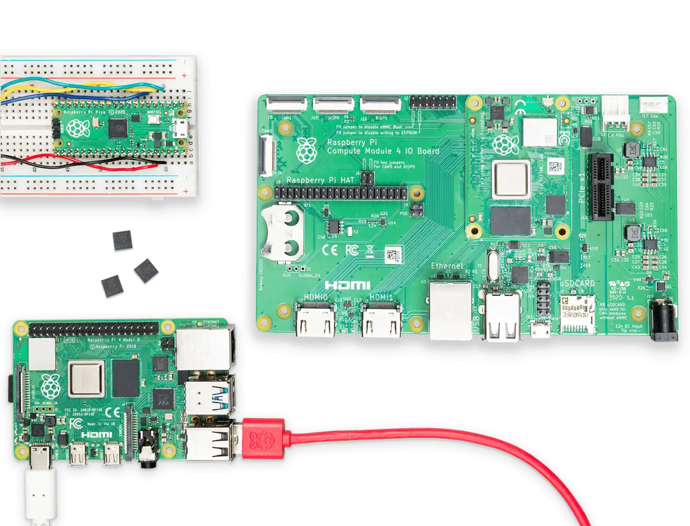
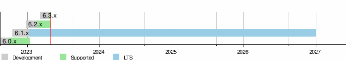

본 내용은 **디버깅을 통해 배우는 리눅스 커널의 구조와 원리 1**의 내용을 최신 리눅스 6.1 LTS 커널에 맞게 정리한 것입니다.

---



이 글에서는 64비트, 라즈베리 파이 4 기준으로 고성능 호스트 시스템에서 크로스 컴파일(cross compile) 후 라즈베리 파이에 전송 및 설치하는 과정을 살펴보겠습니다. 이번 글에서 호스트 시스템은 **우분투 서버 22.04 LTS**를 사용했습니다.

{/*  */}

이번에 다룰 리눅스 커널 6.1 LTS는 2022년 12월 11일에 릴리즈되어 2026년 12월 31일까지 지원되는 장기 지원 버전입니다. 주요 특징으로 **러스트(Rust)** 프로그래밍 언어 적용 등이 있습니다.

# 빌드 환경 준비

리눅스 커널을 빌드하려면 실제 리눅스 머신을 준비하는 것이 좋습니다. 사정이 여의치 않다면 윈도우 상에서 **WSL 2**(Windows Subsystem for Linux 2)를 사용해도 괜찮습니다. 하지만 여러 레이어를 거치는 WSL 특성상 하드웨어의 성능을 온전히 발휘하지는 못한다는 점을 감안해야 합니다.

그럼, [**라즈베리 파이 재단에서 제공하는 공식 문서**](https://www.raspberrypi.com/documentation/computers/linux_kernel.html)를 바탕으로 살펴보겠습니다.

## 패키지 설치

```Bash
$ sudo apt install git bc bison flex libssl-dev make libc6-dev libncurses5-dev
```

먼저 커널 빌드에 필요한 기본 패키지들을 설치합니다.

```Bash
$ sudo apt install crossbuild-essential-arm64
```

그 다음, `aarch64`로 크로스 컴파일을 하기 위한 **툴체인**(toolchain)을 설치합니다. 크로스 컴파일을 할 때 사용하는 패키지들의 집합이라 생각하시면 되겠습니다.

```Bash
$ git clone --depth=1 --branch rpi-6.1.y https://github.com/raspberrypi/linux
```

여기서 `--depth=1` 옵션을 지정하지 않으면 repository의 전체 커밋 데이터를 모두 받아오게 되므로 용량을 많이 차지할 뿐만 아니라 클론해오는 시간도 오래 걸립니다. 소스 코드를 살펴보기만을 원하거나, 커널 빌드만을 원한다면 이렇게 설정하는 것이 좋습니다.

또한 여기서는 `--branch rpi-6.1.y` 옵션을 주어 6.1 커널 브랜치(branch)만을 받아오도록 하였습니다. 이유는 위 `--depth` 옵션과 비슷합니다.

## 커널 구성 설정

이제 커널 빌드 전 타겟에 대한 설정을 해주겠습니다. 공식 문서에서는 step-by-step으로 안내하고 있는데요, 우리는 이를 한데 모은 빌드 스크립트를 작성하여 사용하려 합니다.

그래도 빌드 스크립트를 작성하기 전에 공식 문서의 내용을 살펴보도록 하겠습니다.

```Bash
$ cd linux
$ KERNEL=kernel8
$ make ARCH=arm64 CROSS_COMPILE=aarch64-linux-gnu- bcm2711_defconfig
```

커널 소스를 클론하면 `linux` 디렉토리가 생성되고 그 밑에 소스가 자리를 잡습니다. 첫 라인을 실행하면 이 위치로 이동합니다.

두 번째 라인으로 커널 타입을 `kernel8`로 지정합니다.

세 번째 라인으로 **BCM2711** SoC(System on Chip)을 타겟으로 하여 커널 기본 구성을 진행합니다. BCM2711은 라즈베리 파이 4에 사용된 SoC입니다. `ARCH=arm64` 및 `CROSS_COMPILE=aarch64-linux-gnu-`는 툴체인을 지정하고 빌드 타겟을 세팅하는 옵션입니다.

### **`LOCALVERSION` 지정하기**

```Bash
$ CONFIG_LOCALVERSION="-v7l-MY_CUSTOM_KERNEL"
```

위와 같이 입력하면 커널의 `LOCALVERSION`을 커스텀할 수 있습니다. `-v7l-MY_CUSTOM_KERNEL`을 원하는 문자열로 대체하세요. `LOCALVERSION`은 굳이 손대지 않아도 괜찮습니다.

# 커널 빌드하기

```Bash
$ make ARCH=arm64 CROSS_COMPILE=aarch64-linux-gnu- Image modules dtbs
```

지금까지 타겟을 지정해줬다면 이제 커널을 실제로 빌드할 차례입니다. 위 명령어를 입력해 빌드를 시작합니다.

### `-j[n]` 옵션으로 멀티 스레드 활용하기

`-j[n]`을 `make` 명령어의 argument로서 넘겨주면 `n`개 스레드를 활용하여 병렬적으로 빌드 작업을 진행하므로 빌드 시간을 단축시킬 수있습니다. 무조건 설정하는 것이 좋으며, 실제 프로세서 수에 `1.5`를 곱한 수를 `n`으로 두면 이상적입니다.

예를 들어 자신의 시스템이 8코어 시스템이라면, `-j14`를 붙이는 식입니다. 프로세서 수는 `nproc` 명령어로 확인할 수 있습니다.

# 커널 설치하기

## SD 카드에 빌드한 이미지 설치하기

이제 빌드한 커널을 SD 카드에 설치해봅니다. 사실 뒤에 소개드릴 빌드 스크립트에서는 임시 디렉토리에 커널과 모듈을 설치한 뒤 이를 `out.tar.gz`로 압축합니다. 하지만 원리르 아는 것이 중요하니 공식 가이드 내용을 살펴보고 넘어가도록 하겠습니다.

우선 라즈베리 파이에 사용했었던 SD 카드를 빌드 시스템에 장착합니다.

```Bash highlights='{"green":"9-11"}'
$ lsblk
NAME                      MAJ:MIN RM   SIZE RO TYPE MOUNTPOINTS
loop0                       7:0    0  63.4M  1 loop /snap/core20/1974
loop1                       7:1    0 111.9M  1 loop /snap/lxd/24322
loop2                       7:2    0  49.8M  1 loop /snap/snapd/18357
loop3                       7:3    0  53.3M  1 loop /snap/snapd/19457
loop4                       7:4    0   103M  1 loop /snap/lxd/23541
loop5                       7:5    0  63.3M  1 loop /snap/core20/1822
sda                         8:0    1  29.8G  0 disk
├─sda1                      8:1    1   256M  0 part
└─sda2                      8:2    1  29.6G  0 part
nvme0n1                   259:0    0 232.9G  0 disk
├─nvme0n1p1               259:1    0     1G  0 part /boot/efi
├─nvme0n1p2               259:2    0     2G  0 part /boot
└─nvme0n1p3               259:3    0 229.8G  0 part
  └─ubuntu--vg-ubuntu--lv 253:0    0   100G  0 lvm  /

```

`lsblk' 명령어로 현 리눅스 머신의 파티션 목록을 볼 수 있습니다. 여기서 주목할 점이 있는데,

```Bash
sda                         8:0    1  29.8G  0 disk
├─sda1                      8:1    1   256M  0 part
└─sda2                      8:2    1  29.6G  0 part
```

`sda` 혹은 `sdb`라는 스토리지 아래에 `sda1`, `sda2` 형식으로 파티션 2개가 있을 것입니다. 일반적으로 `sda1` 파티션 용량은 256MB, 나머지는 SD 카드의 나머지 용량입니다. 그러면 이 `sda` 혹은 `sdb` 스토리지가 바로 SD 카드입니다.

```Bash
$ mkdir mnt
$ mkdir mnt/fat32
$ mkdir mnt/ext4
$ sudo mount /dev/sdb1 mnt/fat32
$ sudo mount /dev/sdb2 mnt/ext4
```

그럼 `mnt` 디렉토리를 만들고 여기에 SD 카드 파티션을 마운트합니다.

```Bash
$ sudo env PATH=$PATH make ARCH=arm64 CROSS_COMPILE=aarch64-linux-gnu- INSTALL_MOD_PATH=mnt/ext4 modules_install
```

이제 커널을 빌드할 때 같이 컴파일되었던 모듈들을 SD 카드에 복사합니다. `env PATH=$PATH`로 환경변수를 주입하고 `INSTALL_MOD_PATH=mnt/ext4`로 `mnt/ext4` 디렉토리에 모듈을 복사하는 모습입니다.

```Bash highlights='{"green":"2","yellow":"6,7"}'
$ sudo cp mnt/fat32/$KERNEL.img mnt/fat32/$KERNEL-backup.img
$ sudo cp arch/arm64/boot/Image mnt/fat32/$KERNEL.img
$ sudo cp arch/arm64/boot/dts/broadcom/*.dtb mnt/fat32/
$ sudo cp arch/arm64/boot/dts/overlays/*.dtb* mnt/fat32/overlays/
$ sudo cp arch/arm64/boot/dts/overlays/README mnt/fat32/overlays/
$ sudo umount mnt/fat32
$ sudo umount mnt/ext4
```

이제 커널 이미지를 복사(<p style={{color:"green", fontWeight:"bold", display:"inline"}}>초록색</p>)하고, 복사가 끝나면 마운트를 해제(<p style={{color:"#f59e0b", fontWeight:"bold", display:"inline"}}>노란색</p>)합니다.

이제 이 SD 카드를 라즈베리 파이에 다시 장착하면 끝입니다.

이 방법의 문제점은, SD 카드를 일일히 장착하기가 귀찮다는 것입니다. 그래서 제가 준비한 빌드 스크립트에서는 `out.tar.gz`를 생성하고 이를 `scp`를 이용하여 라즈베리파이에 네트워크로 커널과 모듈 파일들을 전송하려 합니다.

## 커스텀 빌드 스크립트

제가 만든 빌드 스크립트는 아래와 같습니다.

```Bash showLineNumber fileName="build.sh" highlights='{"red":"44", "yellow":"41", "green":"5,18,21", "blue":"31-37"}'
#!/bin/bash

echo "configure build output path..."
KERNEL_TOP_PATH="$(cd "$(dirname "$0")"; pwd -P)"
OUTPUT_PATH="$KERNEL_TOP_PATH/out" # use custom build artifact path
echo "Output Path: ${OUTPUT_PATH}"

KERNEL=kernel8
BUILD_LOG_PATH="$KERNEL_TOP_PATH/build.log"

echo "move to kernel source tree..."
cd linux

echo "make defconfig..."
make O=$OUTPUT_PATH ARCH=arm64 CROSS_COMPILE=aarch64-linux-gnu- bcm2711_defconfig

echo "kernel build..."
make O=$OUTPUT_PATH ARCH=arm64 CROSS_COMPILE=aarch64-linux-gnu- Image modules dtbs -j3 2>&1 | tee $BUILD_LOG_PATH

echo "move to tmp as sdcard..."
cd $OUTPUT_PATH

echo "delete previous out.tar.gz"
rm mnt/out.tar.gz

echo "mount partitionk..."
mkdir mnt
mkdir mnt/fat32
mkdir mnt/fat32/overlays
mkdir mnt/ext4
env PATH=$PATH make ARCH=arm64 CROSS_COMPILE=aarch64-linux-gnu- INSTALL_MOD_PATH=mnt/ext4 modules_install

echo "copy kernel and device tree blobs to sdcard..."
cp arch/arm64/boot/Image mnt/fat32/$KERNEL.img
cp arch/arm64/boot/dts/broadcom/*.dtb mnt/fat32/
cp arch/arm64/boot/dts/overlays/*.dtb* mnt/fat32/overlays/
cp arch/arm64/boot/dts/overlays/README mnt/fat32/overlays/

echo "compressing output files..."
cd mnt
tar -zcvf out.tar.gz *

echo "clean up..."
rm -r fat32 ext4

echo "complete!"
echo "result is in out/mnt/out.tar.gz"
```

```Bash showLineNumber fileName="install.sh"
#!/bin/bash

tar -zxvf out.tar.gz

sudo cp -rv ext4/* /
sudo cp -rv fat32/* /boot

rm -rv ext4 fat32

sudo shutdown -r 0
```

`build.sh`의 5라인에서는 `OUTPUT_PATH`로 빌드 결과물을 출력할 경로를 설정합니다. 이를 설정하지 않으면 소스 트리에 소스 파일과 빌드 결과물이 뒤섞이게 되는데, 그러면 소스 코드를 분석하는 데 상당히 방해되기도 합니다.

18라인에서는 `make` 명령어 뒤에 `| tee $BUILD_LOG_PATH`로 빌드 시 출력 결과들을 모두 `$KERNEL_TOP_PATH/build.log` 파일에 저장하도록 하였습니다.

그 다음, 21라인을 실행하여 결과물들이 저장된 폴더로 이동합니다.

31~37라인에서는 커널 이미지와 모듈을 임시 폴더에 복사합니다. 임시 디렉토리의 경로는 `linux/out/mnt`입니다. 이 밑에 `/linux/out/mnt/ext4`, `/linux/out/mnt/fat32`가 존재하게 됩니다. 물론 44라인에서 이 임시 디렉토리들이 제거됩니다.

41라인에서는 임시 디렉토리의 내용을 압축하여 `linux/mnt/out.tar.gz`라는 파일로 만듭니다.

이 `out.tar.gz` 파일은 다음과 같이 `scp`로 라즈베리 파이에 전송할 수 있습니다.

`build.sh` 파일은 `chmod +x build.sh`로 **실행 권한**을 부여해야 실행할 수 있습니다.

```Bash
$ ./build.sh
```

실행은 위와 같이 합니다.

이제 라즈베리 파이에 `out.tar.gz`를 전송할 차례입니다.

```Bash
$ scp linux/mnt/out.tar.gz {user_name}@raspberrypi:/home/{user_name}/
```

이렇게 하면 라즈베리 파이 상에서 `/home/{user_name}/out.tar.gz` 파일이 생성됩니다.

`install.sh`는 라즈베리 파이 위에서 실행하는 파일입니다. 마찬가지로 `chmod +x install.sh`로 실행 권한을 부여해야 합니다.

그 다음,

```Bash
$ sudo sh install.sh
```

위와 같이 실행하면 빌드했던 커널 이미지와 모듈들이 시스템에 설치됩니다. 이때, **파일 복사 완료 후 자동으로 재부팅되도록 하였으므로 원치 않는다면 파일을 수정하시기 바랍니다.**.

# 올바르게 커널이 적용되었는지 확인

이제 커널이 잘 설치되었는지 확인할 차례입니다.

아래와 같이 입력해봅니다.

```Bash
$ uname -a
Linux raspberrypi 6.1.43-v8+ #2 SMP PREEMPT Sat Aug  5 07:10:50 UTC 2023 aarch64 GNU/Linux
```

여기서 주목해야 할 부분은 `Sat Aug  5 07:10:50 UTC 2023`입니다. 이것이 커널을 빌드한 시점입니다. 자신이 커널을 빌드한 시간과 일치한다면 커널을 잘 빌드하고 잘 적용한 것입니다.
