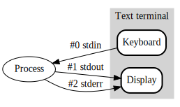

# `tee` 유틸리티

> The **tee** utility copies standard input to standard output, making a copy
 > in zero or more files.  The output is unbuffered.

`tee` 유틸리티는 표준 입력(standard input)을 표준 출력(standard output)으로 그대로 복사함과 동시에, 인자로 주어진 모든 파일(0개 이상)에도 그 내용을 기록합니다.

아래는 기본적인 사용법과 결과입니다.

```bash
$ echo "hello tee" | tee hello.out
hello tee
$ ls
$ hello.out
$ cat hello.out
hello tee
```

tee의 인자로 주어지는 파일은 0개 이상이라 했는데, 따라서
- 출력할 파일을 명시하지 않아도 작동 가능합니다.
- 2개 이상 파일에 동일 내용을 출력할 수 있습니다.

```bash
$ echo "multiple" | tee 1.out 2.out 3.out
multiple
$ ls
1.out    2.out    3.out    4.out
$ cat 1.out
multiple
$ cat 2.out
multiple
$ cat 3.oout
multiple
```

한편, null device(`/dev/null`)로 `tee`의 출력값을 리다이렉트하면 파일에는 출력이 기록되면서도 쉘에는 출력(표준 출력)되지 않도록 할 수 있습니다.

```bash
$ echo "silent" | tee silent.out > /dev/null
$ ls
silent.out
$ cat silent.out
silent
```
# redirect

**redirect**는 shell 차원에서 지원 및 처리하는 기능입니다. 기본적으로,



- 프로그램의 표준 입력은 표준 입력 스트림(stdin, `fd 0`)에서 받습니다.
- 프로그램의 표준 출력은 표준 출력 스트림(stdout, `fd 1`)로 출력됩니다.
- 프로그램의 표준 에러는 표준 에러 스트림(stderr, `fd 2`)로 출력됩니다.

리다이렉트는 이들 스트림의 방향을 명시적으로 바꿉니다. `tee` 유틸리티와 유사한 사용례가 많습니다.

```bash
$ echo "hello" > hello.out
$ cat hello.out
hello
```

하지만, shell 차원에서 다루는 기능이라, redirect 작업은 shell의 권한을 그대로 따릅니다. 아래는 Elasticsearch를 설치할 때 GPG 키 등록시 `tee` 유틸리티를 사용하는 예입니다. **`tee` 유틸리티는 명시적으로 슈퍼유저 권한을 부여받았습니다.**

```bash
echo "deb [signed-by=/usr/share/keyrings/elasticsearch-keyring.gpg] https://artifacts.elastic.co/packages/9.x/apt stable main" | sudo tee /etc/apt/sources.list.d/elastic-9.x.list
```

`tee` 유틸리티 대신 리다이렉트로 실행하면 권한이 부족하다는 에러가 발생합니다.

```bash
$ echo "deb [signed-by=/usr/share/keyrings/elasticsearch-keyring.gpg] https://artifacts.elastic.co/packages/9.x/apt stable main" > /etc/apt/sources.list.d/elastic-9.x.list
-bash: /etc/apt/sources.list.d/elastic-9.x.list: Permission denied
```

물론 슈퍼유저 권한으로 쉘이 실행시켰다면 잘 작동할 것입니다. 그러나 이렇게 실행 주체의 차이가 있다는 점을 잘 기억해두세요.
